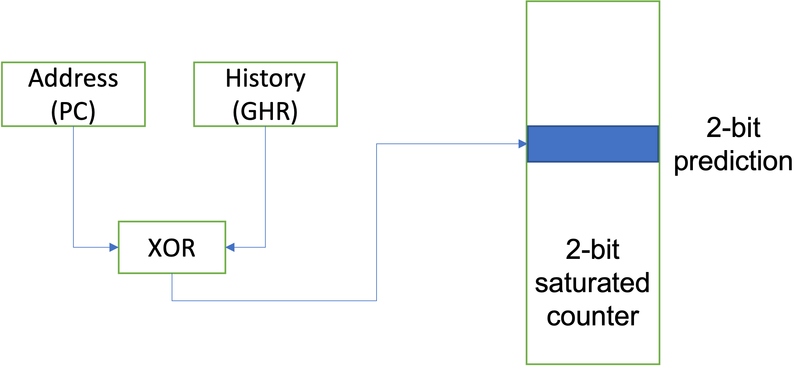
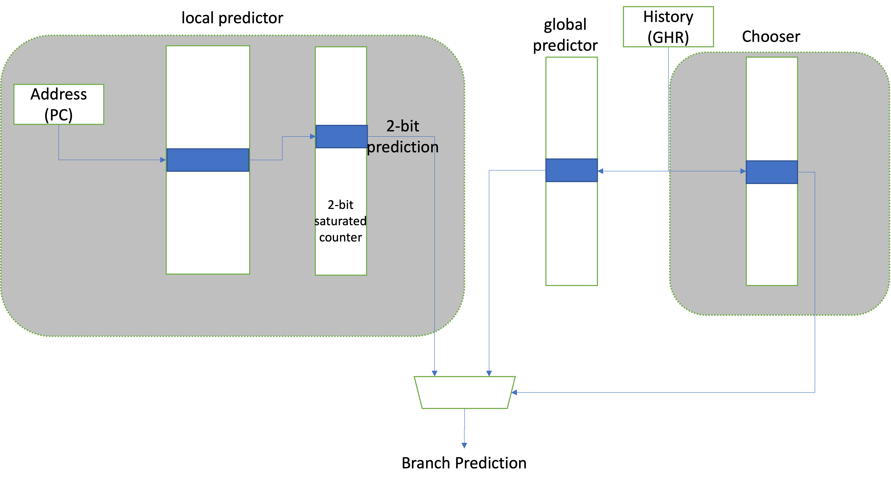
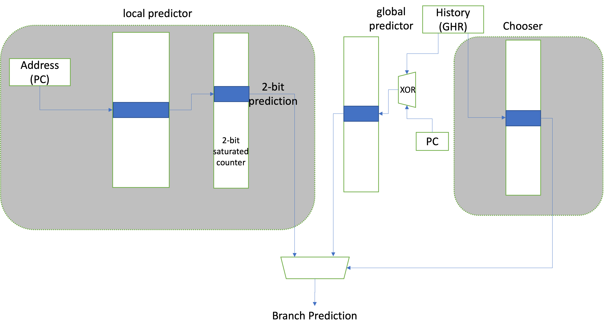
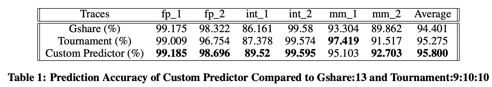

# CSE240A Branch Predictor Project

## Table of Contents
  * [Introduction](#introduction)
  * [How to run the code](#How-to-run-the-code)
  * [Model introductions and command line parameters](#Model-introductions-and-command-line-parameters)
    - [Gshare](#Gshare)
    - [Tournament](#tournament)
    - [Custom](#custom)
  * [Performance](#Performance)

## Introduction

Branch prediction is critical to performance in modern processors.  An accurate branch predictor ensures that the front-end of the machine is capable of feeding the back-end with correct-path instructions. Beyond its criticality in processor execution, branch prediction is an interesting problem.  How do you make accurate predictions on little data using small, fast hardware structures.

For this Project I implemente three branch predictors in a simulated environment: a Gshare predictor, a Tournament predictor and a custom predictor which beats the previous two predictors in terms of the average prediction accuracy acorss six traces.

## How to run the code

Considering the difference between different operation systems, I highly recommendable you to use Docker. If you don't want to work with Docker, then you can run the code on Ubuntu 16.04 with gcc-5.4.

After successfully downloading Docker [(download here)](https://docs.docker.com/get-started/), you can run the code with the following scripts:
```
docker pull prodromou87/ucsd_cse240a # pull the image

# address1 is the address for the file you clone with Git, address2 is the address you want to mount on the virtual image.
# On my machine, this should be: docker run --rm -it -v /Users/yinliang/Desktop/21fall/240A/CSE240A:/wyl prodromou87/ucsd_cse240a
docker run --rm -it -v address1:address2 prodromou87/ucsd_cse240a

cd address2/src

run run.sh
```
## Model introductions and command line parameters 

### Gshare

```
Configuration:
    ghistoryBits    // Indicates the length of Global History kept
```
The Gshare predictor is characterized by XORing the global history register with the lower bits (same length as the global history) of the branch's address.  This XORed value is then used to index into a 1D BHT of 2-bit predictors, which is shown as following:

With a memory constraint of 16 kb, I set ghistoryBits = 13 in run.sh.

### Tournament
```
Configuration:
    ghistoryBits    // Indicates the length of Global History kept
    lhistoryBits    // Indicates the length of Local History kept in the PHT
    pcIndexBits     // Indicates the number of bits used to index the PHT
```

Tournament model is shown as following:

With a memory constraint of 16 kb, I set ghistoryBits = 9, lhistoryBits = 10, pcIndexBits = 10 in run.sh.

### Custom

I combined Gshare and Tournament models: replacing the GHR inputing the Tournament predictor with the Gshare model input, in other words, replacing GHR with GHR xor PC as the input of the global predictor. With such a tiny modification, our custom model can beat previous two models easily.

```
Configuration:
    ghistoryBits    // Indicates the length of Global History kept
    lhistoryBits    // Indicates the length of Local History kept in the PHT
    pcIndexBits     // Indicates the number of bits used to index the PHT
```

Our custom model is shown as following:

With a memory constraint of 64 kb, I set ghistoryBits = 13, lhistoryBits = 11, pcIndexBits = 11 in run.sh.


## Performance
The performance is as following:


According to this table, we can find that our custom model beats the previous two predictors in terms of the average prediction accuracy acorss six traces.